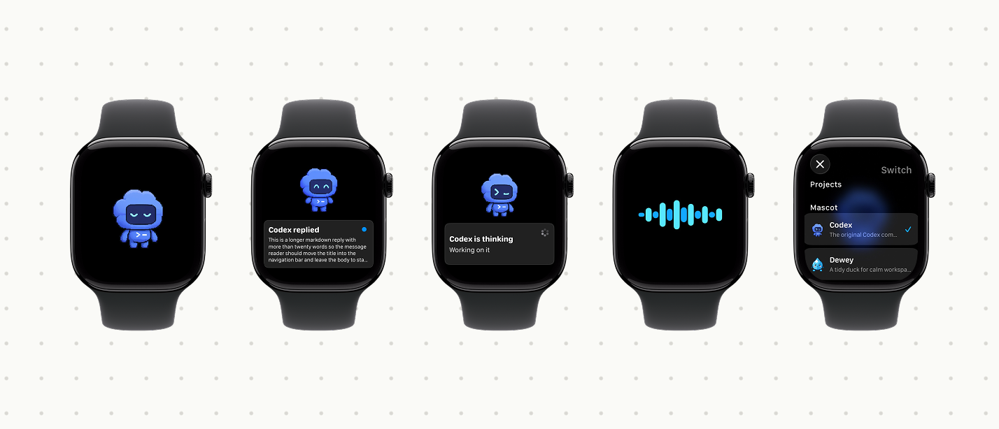

# Codex Watch Companion



## Install via Codex (prompt)

Paste this into Codex while this repo is open:

```text
Prepare and install the Codex Watch Companion. Run CODEX_WATCH_SHOW_NETWORK_HINTS=1 ./scripts/install.sh --test --device <APPLE_WATCH_DEVICE_ID>, start the bridge, install the watchOS app, launch it on my Apple Watch, and tell me the bridge URL plus any errors. If you need the watch device id, run xcrun devicectl list devices first.
```

For the simulator:

```sh
./scripts/install.sh --test --simulator
```

For a physical Apple Watch:

```sh
xcrun devicectl list devices
./scripts/install.sh --test --device <APPLE_WATCH_DEVICE_ID>
```

## What It Is

Codex Watch Companion is a proof-of-concept Apple Watch app for keeping a Codex pet visible while a Mac runs Codex. The watch talks to a small bridge process on the Mac over WebSocket/HTTP, streams microphone audio to the bridge, sends transcripts into the selected Codex chat, and receives task state plus reply text back.

The first screen shows the pet plus the currently selected chat. Tap the pet for voice mode, tap the chat preview to read it, long-press the pet for project/chat selection, and use the Digital Crown to move through real chats.

## What Works

- Built-in Codex pet sprites plus authenticated runtime sync of third-party v1/v2 pets installed under `~/.codex/pets`.
- Mac bridge at `ws://<mac-lan-ip>:17842/codex-watch`.
- Secure remote bridge support through `wss://` and an optional bearer token.
- Watch microphone streaming as base64 `pcm-f32le`.
- Transcription through the same Codex Desktop auth path by default, with optional direct OpenAI fallback.
- Project/chat picker populated from the 10 most recently interacted main conversations under `~/.codex/sessions`; subagent sessions are excluded.
- First-run onboarding for choosing a pet and selecting a project/chat.
- New chat creation from the switcher or a project chat list.
- Project/chat sections capped to six rows with `View all` controls for larger histories.
- Voice transcript review and send flow.
- Streaming reply previews from Codex app-server turn events.
- Scrollable conversation history with the most recent five user/assistant messages.
- Markdown rendering in full message view, including inline code/link attributes.
- Haptics for send, reply, transcript, and failure states.
- Durable unread/thinking state across watch app restarts and bridge reconnects, plus app-open state refresh for the selected chat.

## Requirements

- macOS with Xcode and watchOS simulator/device support.
- Node.js 20+.
- `/Applications/Codex.app` or a `codex` CLI that supports `app-server`.
- A paired Apple Watch for device installs, or a watchOS simulator.
- Optional: `tmux` for keeping the bridge running in a named session.

## Install Script

The installer starts/restarts the Mac bridge, builds the watch app, installs it, and launches it.

```sh
./scripts/install.sh --device <APPLE_WATCH_DEVICE_ID>
```

Useful modes:

```sh
./scripts/install.sh --bridge-only
./scripts/install.sh --simulator
./scripts/install.sh --test --device <APPLE_WATCH_DEVICE_ID>
```

For a free Personal Team, pass a unique bundle identifier and the team ID shown by Xcode:

```sh
CODEX_WATCH_BUNDLE_ID=com.example.codexwatch \
CODEX_WATCH_DEVELOPMENT_TEAM=<PERSONAL_TEAM_ID> \
CODEX_WATCH_SERVER_URL=wss://watch.example.com/codex-watch \
CODEX_WATCH_AUTH_TOKEN='<saved-token>' \
./scripts/install.sh --device <APPLE_WATCH_DEVICE_ID>
```

The installer passes the URL and token to the newly launched Watch app once. The app persists the URL in UserDefaults and the token in the watchOS Keychain, so long tokens do not need to be entered on the Watch.

The bridge log is written to:

```text
build/codex-watch-bridge.log
```

If `tmux` is installed, the installer starts the bridge in a detached session named `codex-watch-bridge`. The script restarts that session each time it starts the bridge, runs a local health check before returning, and supervises the bridge so it restarts automatically if Node exits.

```sh
CODEX_WATCH_SHOW_NETWORK_HINTS=1 ./scripts/install.sh --bridge-only
tmux ls
tmux attach -t codex-watch-bridge
tail -f build/codex-watch-bridge.log
```

Stop the detached bridge:

```sh
tmux kill-session -t codex-watch-bridge
```

Tune crash restart delay:

```sh
CODEX_WATCH_RESTART_DELAY=5 ./scripts/install.sh --bridge-only
```

## Manual Bridge

```sh
npm run bridge
```

By default the bridge avoids printing machine-specific network details. To print connection URLs while pairing a watch, run:

```sh
CODEX_WATCH_SHOW_NETWORK_HINTS=1 npm run bridge
```

That prints URLs like:

```text
ws://<your-mac-lan-ip>:17842/codex-watch
ws://<your-mac-hostname>.local:17842/codex-watch
ws://127.0.0.1:17842/codex-watch
```

Set `CODEX_WATCH_OPEN_CODEX=1` if you want the bridge to open `/Applications/Codex.app` when the watch connects.

Set `CODEX_WATCH_AUTH_TOKEN` to require the same bearer token from the watch for WebSocket and HTTP fallback requests:

```sh
CODEX_WATCH_AUTH_TOKEN='<long-random-token>' ./scripts/install.sh --bridge-only
```

Leave the variable unset for the original unauthenticated local-LAN behavior.

To start the bridge manually in `tmux` without the installer:

```sh
mkdir -p build
tmux kill-session -t codex-watch-bridge 2>/dev/null || true
tmux new-session -d -s codex-watch-bridge "cd \"$PWD\" && exec env CODEX_WATCH_SHOW_NETWORK_HINTS=1 bash scripts/run-bridge-supervisor.sh"
tail -f build/codex-watch-bridge.log
```

## Secure Remote Access

Keep the bridge and Codex app-server on the Mac that owns `~/.codex/sessions`. Publish the local bridge through a TLS reverse proxy or tunnel, and keep port `17842` private to the Mac and trusted LAN.

Generate and save a token:

```sh
openssl rand -hex 32
```

Start the bridge with that token:

```sh
CODEX_WATCH_AUTH_TOKEN='<saved-token>' \
  CODEX_WATCH_SHOW_NETWORK_HINTS=1 \
  ./scripts/install.sh --bridge-only
```

The installer carries `CODEX_WATCH_AUTH_TOKEN` into its detached tmux supervisor. Restart the bridge with the same token after changing its environment.

For a named Cloudflare Tunnel, route one hostname to the local bridge:

```yaml
tunnel: <TUNNEL_UUID>
credentials-file: /Users/<mac-user>/.cloudflared/<TUNNEL_UUID>.json

ingress:
  - hostname: watch.example.com
    service: http://127.0.0.1:17842
  - service: http_status:404
```

Run `cloudflared` as a persistent macOS service after the named tunnel and DNS route are created. The public Watch URL is then:

```text
wss://watch.example.com/codex-watch
```

On the watch, long-press the pet, open `Bridge Settings`, enter the public `wss://` URL and the saved token, then tap `Connect`. The app stores the token in the watchOS Keychain. The same public URL works on local Wi-Fi and remote cellular/Wi-Fi networks. `wss://` uses system certificate validation, so use a publicly trusted certificate whose hostname matches the configured URL.

The bridge keeps `GET /` available as a minimal health check. WebSocket upgrades and the `/codex-watch/message` and `/codex-watch/poll` command endpoints require the bearer token whenever `CODEX_WATCH_AUTH_TOKEN` is set.

## Watch Controls

- Tap pet: start voice mode.
- Tap waveform: stop recording and transcribe.
- Send: sends the transcript into the selected Codex chat.
- Long-press pet: open project/chat picker.
- Bridge Settings in the picker: set the local or remote bridge URL and bearer token.
- New Chat: start a fresh Codex thread for the selected project.
- Digital Crown: cycle through real Codex chats; the current chat title is shown below the pet.
- Current chat preview or a chat row: open the most recent five user/assistant messages.
- Double Tap: open visible text if present, otherwise start voice mode.
- Reply button in message view: scroll to the bottom of the message and tap `Reply`.

## State Model

The bridge sends these watch-visible states:

- `idle`: bridge linked and no active task.
- `thinking`: Codex has started and is working before reply text arrives.
- `running`: audio/transcript/send/reply work is in progress.
- `review`: a reply or approval/input request is ready.
- `failed`: an error needs attention.

Unread replies and thinking/running task cards are persisted locally on the watch. The bridge also replays the last durable task state when the watch reconnects, and on app open asks Codex app-server for the selected chat state so completed replies or active work are restored when possible. Opening a message marks it read and clears the replay state for the current project/chat.

Chat selection and chat opening are separate protocol actions. `chat-selected` updates the current target while Crown scrolling; `chat-opened` requests conversation content. The bridge excludes subagent sessions, keeps the 10 most recently interacted main conversations, reads persisted session JSONL first, and uses paginated app-server history when a local session is unavailable. Conversation responses contain the latest five user/assistant messages. Pet and chat selections remain isolated per connected Watch client.

On each Watch connection and picker refresh, the bridge reads third-party pet manifests from `~/.codex/pets`. It sends the pet metadata to the Watch and exposes each PNG/WebP spritesheet through a bearer-authenticated asset endpoint. The Watch downloads and renders v1 8×9 and v2 8×11 spritesheets dynamically, so newly installed Mac pets require only a Watch reconnect rather than a source-code change.

## Development

Run bridge tests:

```sh
npm run check
```

Run watch tests:

```sh
xcodebuild -project CodexWatchCompanion.xcodeproj \
  -scheme CodexWatchCompanion \
  -destination 'platform=watchOS Simulator,name=Apple Watch Series 11 (46mm)' \
  -derivedDataPath build/DerivedData \
  test
```

Build for a physical watch:

```sh
xcodebuild -project CodexWatchCompanion.xcodeproj \
  -scheme CodexWatchCompanion \
  -destination 'generic/platform=watchOS' \
  -derivedDataPath build/DerivedData \
  -allowProvisioningUpdates \
  build
```

## Screenshot Fixtures

The app supports deterministic UI fixtures for screenshots and UI tests:

```sh
CODEX_WATCH_UI_TEST_SCENARIO=markdown
CODEX_WATCH_UI_TEST_SCENARIO=long-message
CODEX_WATCH_UI_TEST_SCENARIO=reader
CODEX_WATCH_UI_TEST_SCENARIO=thinking
CODEX_WATCH_UI_TEST_SCENARIO=voice
CODEX_WATCH_UI_TEST_SCENARIO=picker
CODEX_WATCH_UI_TEST_SCENARIO=picker-many
CODEX_WATCH_UI_TEST_SCENARIO=picker-chat-open
CODEX_WATCH_UI_TEST_SCENARIO=onboarding
CODEX_WATCH_UI_TEST_SCENARIO=crown-home
CODEX_WATCH_UI_TEST_SCENARIO=conversation
```

Screenshots captured during release prep live in:

```text
docs/screenshots/
```

## Notes

- watchOS does not let third-party apps stay awake forever off-wrist. This app starts a `WKExtendedRuntimeSession`, but a dedicated old watch should also have Wrist Detection disabled in system settings.
- If the Mac Wi-Fi IP changes, rerun the bridge and update the watch bridge URL if needed.
- This is a proof of concept, not a hardened App Store release.
